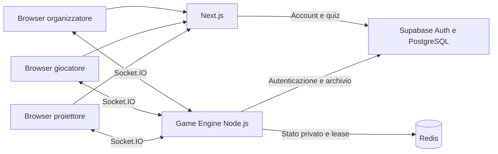

# Quizzone

Quizzone è una web app per creare e condurre quiz multiplayer in tempo reale. Il conduttore prepara le domande, apre una partita e invita i partecipanti tramite un **codice di sei cifre**, un **collegamento** o un **QR code**. I giocatori scelgono un nickname dal proprio telefono e partecipano senza registrarsi.

Il progetto comprende l’editor dei quiz, l’area organizzatori, le tre schermate di gioco e un Game Engine personalizzato che gestisce tempi, risposte, punteggi e archiviazione.

## Nota sulla creazione dei quiz

La creazione di un quiz passa dalla route server `POST /api/quizzes`. La pagina
del form non inserisce direttamente dati in Supabase: invia titolo e descrizione
al server, che legge l’utente autenticato dai cookie Supabase, valida il titolo
e assegna `owner_id` usando esclusivamente `user.id` della sessione verificata.

Questo flusso è intenzionale: la policy PostgreSQL di `public.quizzes` consente
l’inserimento solo quando `owner_id = auth.uid()`. Non disabilitare RLS e non
accettare `owner_id` dal body della richiesta, perché permetterebbe a un utente
di tentare di creare quiz intestati a un altro account.

La route genera l’UUID prima dell’`INSERT` e restituisce quell’identificativo
senza eseguire un `SELECT` automatico sulla riga appena creata. In questo modo
la creazione non dipende da una policy di lettura aggiuntiva per il ritorno dei
dati. In caso di sessione assente, titolo vuoto o errore database la route
restituisce una risposta HTTP distinta e la pagina mostra il relativo messaggio.

Per il funzionamento corretto:

1. configurare `NEXT_PUBLIC_SUPABASE_URL` e `NEXT_PUBLIC_SUPABASE_ANON_KEY` con
  lo stesso progetto Supabase usato nel SQL Editor;
2. applicare la policy `INSERT` per il ruolo `authenticated` descritta nella
  sezione Supabase;
3. riavviare Next.js dopo ogni modifica alle variabili `NEXT_PUBLIC_*`;
4. effettuare nuovamente il login per ottenere una sessione aggiornata.

La chiave `service_role` non serve alla route Next.js e non deve essere inserita
nel frontend: è riservata al processo Game Engine e al suo archivio server-side.

## Indice

- [Funzionalità disponibili](#funzionalità-disponibili)
- [Architettura](#architettura)
- [Requisiti](#requisiti)
- [Installazione](#installazione)
- [Configurazione delle variabili d’ambiente](#configurazione-delle-variabili-dambiente)
- [Configurazione di Supabase](#configurazione-di-supabase)
- [Avvio e arresto dei servizi](#avvio-e-arresto-dei-servizi)
- [Utilizzo da smartphone e rete locale](#utilizzo-da-smartphone-e-rete-locale)
- [Creare e condurre una partita](#creare-e-condurre-una-partita)
- [Regole, timer e punteggi](#regole-timer-e-punteggi)
- [Persistenza e controllo degli accessi](#persistenza-e-controllo-degli-accessi)
- [Struttura del repository](#struttura-del-repository)
- [Comandi disponibili](#comandi-disponibili)
- [Test e verifiche](#test-e-verifiche)
- [Risoluzione dei problemi](#risoluzione-dei-problemi)
- [Distribuzione in produzione](#distribuzione-in-produzione)
- [Limiti attuali](#limiti-attuali)

## Funzionalità disponibili

| Area | Funzioni implementate |
| --- | --- |
| Account organizzatore | Registrazione, accesso con email e password, conferma tramite collegamento email, uscita e rinnovo della sessione |
| Dashboard | Elenco dei quiz accessibili, creazione, apertura dell’editor, avvio e ripresa delle partite aperte |
| Editor | Testo e immagine tramite URL, opzioni, risposte corrette, riordino delle domande, tempi, punti e salvataggio atomico |
| Inviti | Codice numerico, collegamento pubblico e QR code con origine configurabile |
| Giocatore | Ingresso senza account, nickname, risposta singola, esito personale, classifica e riconnessione |
| Conduttore | Lobby, avvio, avanzamento delle fasi, chiusura anticipata e rimozione dei partecipanti |
| Proiettore | Visualizzazione pubblica della partita, del QR e delle classifiche |
| Motore | Timer autoritativi, validazione degli invii, punteggi, revisioni dello stato, persistenza Redis e archivio Supabase |
| Verifiche | Test PostgreSQL, test del motore e prove browser delle viste desktop e touch |

La registrazione serve agli organizzatori. Giocatori e proiettore comunicano con il motore senza un account Supabase.

## Architettura

| Componente | Tecnologia | Responsabilità |
| --- | --- | --- |
| Applicazione web | Next.js 16, React 19, TypeScript, Tailwind CSS 4 | Pagine, editor, autenticazione e visualizzazione delle partite |
| Account e dati | Supabase Auth e PostgreSQL | Utenti, quiz, permessi e risultati archiviati |
| Game Engine | Node.js 22+, Express e Socket.IO 4 | Regole, fasi, timer, connessioni e calcolo dei risultati |
| Stato delle partite | Redis 7 oppure memoria di sviluppo | Snapshot privati, recupero dopo riavvio e proprietà esclusiva del motore |
| Test | Node Test Runner, PGlite e Playwright | Logica, SQL, trasporto realtime e flussi browser |



Next.js e Game Engine sono **due processi distinti**. Avviare il frontend non avvia il motore. Il browser si collega direttamente al motore usando `NEXT_PUBLIC_GAME_SERVER_URL`.

Il frontend visualizza lo stato ricevuto; il motore decide quando accettare una risposta e quanti punti assegnare. La correttezza delle opzioni non viene pubblicata prima della fase di rivelazione.

## Requisiti

- **Node.js 22 o successivo**, con npm.
- Un progetto **Supabase** di cui si possa usare il SQL Editor.
- **Redis**, consigliato anche per lo sviluppo; Docker è necessario solo se si sceglie l’esempio con container.
- Un browser. Per i test automatici: Chromium di Playwright oppure Chrome già installato.
- Per provare con uno smartphone: telefono e computer su una rete che consenta comunicazioni tra dispositivi.

I due `package-lock.json` fissano le dipendenze rispettivamente del frontend e del motore. Vanno conservati nel repository e usati con `npm ci`.

## Installazione

```bash
git clone https://github.com/MaicolMoretti/Quizzone.git
cd Quizzone
npm ci
npm --prefix socket-server ci
cp .env.example .env.local
cp socket-server/.env.example socket-server/.env
```

I comandi `cp` servono alla prima configurazione: se i file esistono già, modificarli senza sovrascrivere i valori presenti. Compilare entrambi i file prima di avviare i servizi.

## Configurazione delle variabili d’ambiente

### Frontend: `.env.local`

| Variabile | Esempio | Uso |
| --- | --- | --- |
| `NEXT_PUBLIC_SUPABASE_URL` | `https://<progetto>.supabase.co` | URL del progetto Supabase |
| `NEXT_PUBLIC_SUPABASE_ANON_KEY` | Chiave pubblica del progetto | Accesso del browser e delle route Next.js; i permessi dipendono da sessione e RLS |
| `NEXT_PUBLIC_GAME_SERVER_URL` | `http://localhost:3001` | Indirizzo del motore raggiungibile dal browser |
| `NEXT_PUBLIC_APP_URL` | `http://localhost:3000` | Origine usata per collegamenti di invito e QR code |

`NEXT_PUBLIC_APP_URL` contiene l’origine, senza `/play` o altri percorsi. Se manca, l’interfaccia usa l’origine della pagina corrente. Per i telefoni occorre un indirizzo raggiungibile in rete, non `localhost`.

Le variabili `NEXT_PUBLIC_*` sono pubbliche e vengono incluse nell’applicazione compilata. In produzione, dopo averle cambiate, ricompilare il frontend; in sviluppo riavviare Next.js.

### Motore: `socket-server/.env`

| Variabile | Esempio o valore iniziale | Uso |
| --- | --- | --- |
| `PORT` | `3001` | Porta HTTP e Socket.IO del motore |
| `FRONTEND_ORIGINS` | `http://localhost:3000` | Origini frontend ammesse, separate da virgole, comprensive di protocollo e porta |
| `SUPABASE_URL` | `https://<progetto>.supabase.co` | Stesso progetto utilizzato dal frontend |
| `SUPABASE_SERVICE_ROLE_KEY` | Chiave `service_role` del progetto | Credenziale riservata per lettura dei quiz e scrittura dello storico |
| `REDIS_URL` | `redis://127.0.0.1:6379` | Connessione Redis; necessaria salvo modalità memoria |
| `GAME_STORE` | `redis` | `memory` seleziona esplicitamente lo store temporaneo di sviluppo |
| `NODE_ENV` | `production` sul server pubblico | In produzione impedisce l’uso dello store in memoria |

La chiave `service_role` deve stare **esclusivamente nel processo del motore**, mai in una variabile `NEXT_PUBLIC_*`. I file `.env.local` e `socket-server/.env` sono esclusi da Git; i modelli `.env.example` sono pubblicabili perché non contengono chiavi reali.

`FRONTEND_ORIGINS` non accetta `*`. Esempio per più origini:

```dotenv
FRONTEND_ORIGINS=http://localhost:3000,http://127.0.0.1:3000,http://192.168.1.50:3000
```

L’indirizzo è solo illustrativo: usare quello effettivo del computer. Il motore carica il proprio `.env` dalla cartella `socket-server`, anche quando viene avviato dalla radice con `npm --prefix`.

## Configurazione di Supabase

### Prima installazione su un database nuovo

Aprire il SQL Editor del progetto ed eseguire **tutto** [database/setup.sql](database/setup.sql).

Lo script crea le sette tabelle applicative, le funzioni, i permessi e le policy in un’unica transazione. Abilita RLS su ogni tabella e si interrompe se trova già tabelle Quizzone: non è una migrazione da rilanciare su un’installazione esistente.

La query finale deve restituire sette righe con `rls_enabled = true`:

| Tabella | Contenuto |
| --- | --- |
| `quizzes` | Titolo, descrizione, proprietario e versione del quiz |
| `quiz_collaborators` | Collaborazioni `editor` o `viewer` |
| `questions` | Domande, ordine, tempi e punti |
| `answers` | Opzioni e correttezza |
| `games` | Partite e stato sintetico |
| `game_players` | Partecipanti e punteggi archiviati |
| `player_answers` | Invii e relativi risultati |

Per ricontrollare RLS in seguito:

```sql
select tablename, rowsecurity as rls_enabled
from pg_tables
where schemaname = 'public'
  and tablename in (
    'quizzes', 'quiz_collaborators', 'questions', 'answers',
    'games', 'game_players', 'player_answers'
  )
order by tablename;
```

### Installazioni già esistenti

Se è già stato applicato lo schema iniziale ma mancano le migrazioni successive, eseguire nell’ordine:

1. [database/game-engine.sql](database/game-engine.sql): RLS dello storico e funzione `archive_game`.
2. [database/editor.sql](database/editor.sql): RLS del contenuto, rimozione logica e funzione `save_quiz`.

Entrambe sono riapplicabili. Sostituiscono alcune policy e un trigger, senza eliminare tabelle o dati applicativi. Gli avvisi del SQL Editor su operazioni distruttive possono riferirsi proprio a `DROP POLICY`, `DROP TRIGGER` e revoche di permessi: controllare lo script concreto prima di confermarlo.

Se l’installazione è completa ma conserva la vecchia policy di lettura che ostacolava `INSERT ... RETURNING`, applicare [database/fix-quiz-creation.sql](database/fix-quiz-creation.sql). La correzione è già inclusa nei file aggiornati `setup.sql` ed `editor.sql`.

[database/schema.sql](database/schema.sql) resta come schema di base per la sequenza di migrazioni e per i test: **non usarlo da solo** come configurazione completa. Per un nuovo progetto usare `setup.sql`, senza eseguire entrambi i percorsi.

### Autenticazione e conferma email

Configurare in Supabase Auth il Site URL del frontend e gli URL di reindirizzamento ammessi, compreso:

```text
http://localhost:3000/auth/callback
```

Aggiungere il corrispondente indirizzo LAN per prove da telefono e quello HTTPS per la produzione. La registrazione usa l’origine della pagina corrente per costruire il collegamento di ritorno.

Quando la conferma email è attiva, la registrazione non apre subito la dashboard: occorre usare il **collegamento ricevuto via email**, non inserire un codice nell’app. Se l’account è già confermato, usare **Accedi**. Per problemi di recapito controllare spam, stato dell’utente e configurazione del servizio email del progetto Supabase.

## Avvio e arresto dei servizi

Tutti i comandi seguenti, salvo indicazioni diverse, si eseguono dalla radice `Quizzone`.

### 1. Redis

Prima creazione del container con volume persistente e AOF:

```bash
docker run -d --name quizzone-redis \
  -p 127.0.0.1:6379:6379 \
  -v quizzone-redis:/data \
  redis:7-alpine redis-server --appendonly yes
```

Se il container esiste già:

```bash
docker start quizzone-redis
```

Verifica:

```bash
docker exec quizzone-redis redis-cli ping
```

La risposta attesa è `PONG`. La porta Redis rimane esposta solo sul computer: i telefoni si collegano al motore, non direttamente a Redis.

Per sviluppo senza Redis si può impostare `GAME_STORE=memory`. Questa modalità perde partite e sessioni al riavvio ed è vietata con `NODE_ENV=production`.

### 2. Game Engine, in un terminale

```bash
npm --prefix socket-server start
```

Il motore ascolta normalmente sulla porta **3001**. Per riavviarlo automaticamente quando cambia il codice usare invece:

```bash
npm run dev:engine
```

Avviare uno solo dei due comandi. Una seconda istanza sullo stesso namespace Redis viene rifiutata.

### 3. Frontend, in un secondo terminale

```bash
npm run dev -- --webpack --hostname 0.0.0.0 --port 3000
```

Aprire [http://localhost:3000](http://localhost:3000) sul computer. `--hostname 0.0.0.0` consente anche l’accesso dalla rete locale; `--webpack` usa il compilatore con cui viene eseguita la suite browser del progetto. Per lo sviluppo standard resta disponibile `npm run dev`.

### Controllo e spegnimento

```bash
curl http://localhost:3001/health
```

Con motore sano restituisce HTTP 200 e `{"ok":true}`. HTTP 503 indica che il processo non è più operativo, per esempio dopo la perdita della lease Redis. Questo controllo riguarda il motore e non costituisce una verifica completa della disponibilità di Supabase.

Per fermare frontend e motore premere **Ctrl+C** nei rispettivi terminali. Per fermare anche Redis:

```bash
docker stop quizzone-redis
```

Il volume Docker conserva i dati. Al successivo avvio far partire Redis prima del motore.

## Utilizzo da smartphone e rete locale

Con telefono e computer sulla stessa rete, dopo aver compilato i due file `.env`:

```bash
npm run configure:lan
```

Lo script seleziona un IPv4 privato del computer e aggiorna:

- `NEXT_PUBLIC_APP_URL`, usato da inviti e QR;
- `NEXT_PUBLIC_GAME_SERVER_URL`, usato dalla connessione realtime;
- `FRONTEND_ORIGINS`, aggiungendo l’origine LAN alle origini già presenti.

Le credenziali rimangono invariate e non vengono stampate. Con più interfacce di rete si può indicare un IP assegnato al computer:

```bash
npm run configure:lan -- 192.168.1.50
```

**Riavviare frontend e Game Engine dopo il comando**, poi aprire dal telefono l’indirizzo stampato. Il QR userà quell’origine anche se il conduttore visita il sito tramite `localhost`.

`localhost` sul telefono indica il telefono stesso. Le porte 3000 e 3001 del computer devono essere raggiungibili; una rete ospiti con isolamento dei dispositivi o un firewall può impedirlo. Ripetere la configurazione quando cambia IP o rete. Usare l’origine LAN anche tra gli URL Auth consentiti se si vuole registrare un organizzatore dal telefono.

Il pulsante **Partecipa** si abilita quando il nickname non è vuoto e il motore è connesso. L’invio da tastiera e il tocco usano lo stesso modulo; durante l’invio vengono bloccati i tocchi ripetuti. Se la connessione manca, l’interfaccia mostra l’attesa invece di procedere senza conferma.

## Creare e condurre una partita

1. Accedere all’area organizzatori e completare la conferma email se richiesta.
2. Dalla dashboard scegliere **Nuovo quiz**, inserire titolo e descrizione e aprire l’editor.
3. Compilare le domande, le opzioni e almeno una risposta corretta per domanda. Impostare tempi e punti; l’immagine è facoltativa e si indica tramite URL HTTP/HTTPS.
4. Premere **Salva quiz**. Attendere la conferma prima di lasciare l’editor: le modifiche non vengono salvate automaticamente.
5. Tornare alla dashboard e premere **Avvia**. La lobby mostra codice, collegamento e QR.
6. I giocatori entrano dalla homepage con il codice oppure aprono il QR, inseriscono il nickname e premono **Partecipa**.
7. Aprire **Apri proiettore** per una schermata pubblica in un’altra scheda o su un monitor.
8. Premere **Inizia il quiz**. Il conduttore può anticipare la chiusura delle risposte, rivelare la soluzione, mostrare la classifica e passare alla domanda successiva.
9. Dopo il podio premere **Concludi e archivia**. **Termina partita** permette di chiudere anche prima.

Le partite aperte compaiono nella dashboard del loro creatore. Ricaricare la pagina del giocatore recupera identità e risposta già inviata se il browser conserva la sessione locale e il motore conserva la partita.

| Percorso | Destinazione |
| --- | --- |
| `/` | Ingresso con codice |
| `/register`, `/login` | Registrazione e accesso organizzatori |
| `/auth/callback` | Conferma della sessione Supabase |
| `/dashboard` | Quiz e partite aperte |
| `/quizzes/new` | Creazione dei metadati del quiz |
| `/quizzes/[quizId]/edit` | Editor |
| `/api/quizzes` | API POST autenticata per creare un quiz |
| `/game/[gameId]/admin` | Conduttore |
| `/game/[gameId]/presentation` | Proiettore |
| `/play/[gameCode]` | Giocatore |

## Regole, timer e punteggi

```text
LOBBY
  → QUESTION_PREVIEW     lettura della domanda, senza opzioni
  → QUESTION_ACTIVE      invio della risposta
  → QUESTION_LOCKED      invii chiusi e punti calcolati
  → ANSWER_REVEAL        soluzione e statistiche
  → LEADERBOARD          classifica
  → NEXT_QUESTION        passaggio alla prossima domanda
  → QUESTION_PREVIEW     ripetizione del ciclo

Dopo l’ultima classifica:
LEADERBOARD → FINAL_RESULTS → ENDED
```

La preview e la fase di risposta terminano automaticamente secondo le scadenze del server. `NEXT_QUESTION` passa alla preview al controllo periodico successivo. Le altre transizioni sono guidate dal conduttore. Un comando amministrativo include la revisione corrente: una scheda non aggiornata o un doppio clic non possono saltare una fase.

| Regola | Valore |
| --- | --- |
| Domande per quiz | Da 1 a 200 |
| Opzioni per domanda | Da 2 a 8 |
| Tempo lettura | Da 0 a 300 secondi |
| Tempo risposta | Da 1 a 600 secondi |
| Punti risposta corretta | Da 0 a 100.000 |
| Punti risposta errata | Da −100.000 a 0 |
| Mancata risposta | 0 punti |
| Nickname | Da 1 a 32 caratteri, univoco nella partita senza distinzione tra maiuscole e minuscole |
| Nuovi ingressi | Solo durante la lobby |
| Riconnessioni | Anche dopo l’avvio, con credenziali della sessione originale |

Ogni giocatore può scegliere **una sola opzione per domanda**, anche se l’autore ha segnato più opzioni come corrette. Non è previsto un bonus velocità: il tempo di risposta viene registrato, ma i punti sono quelli configurati nel quiz.

A parità di punti il rango è condiviso, per esempio `1, 1, 3`. Le percentuali delle opzioni sono calcolate sul numero di invii ricevuti. Un giocatore espulso scompare dalla classifica, ma gli invii già effettuati rimangono nello storico.

## Persistenza e controllo degli accessi

### Salvataggio dell’editor

La route `/api/quizzes` verifica l’utente e assegna sul server l’`owner_id`; il browser non può scegliere un altro proprietario. L’UUID viene generato prima dell’inserimento, evitando di dipendere da `INSERT ... RETURNING` per aprire l’editor.

`save_quiz` salva titolo, descrizione, domande e risposte in una transazione. Verifica i permessi, blocca la riga del quiz e confronta `updated_at` con la versione letta dal browser. Se la versione è cambiata, il salvataggio viene rifiutato; se qualsiasi campo non è valido, l’intera operazione viene annullata.

Le domande e le opzioni rimosse diventano `retired`, senza eliminazione fisica. Questo conserva gli identificativi referenziati dallo storico. Non è però un archivio completo delle versioni del contenuto: modificare il testo di un elemento mantenendone l’UUID aggiorna il record esistente.

### Partita in corso e archivio

Redis conserva lo stato privato dopo ogni mutazione, prima della conferma al client. Al riavvio il motore azzera i vecchi socket e recupera le scadenze assolute. Per sopravvivere anche a un riavvio di Redis occorre la sua persistenza, come AOF nell’esempio Docker.

Supabase riceve subito il record della lobby e lo stato di avvio. Alla conclusione `archive_game` salva insieme giocatori, invii e stato finale; gli UUID rendono ripetibile l’archiviazione senza duplicare le risposte.

Redis e PostgreSQL non condividono una transazione: un’interruzione tra le due scritture può richiedere un nuovo tentativo di conclusione. I quiz con partite `waiting` o `active` non sono modificabili nell’editor.

### Permessi

| Identità | Accessi previsti |
| --- | --- |
| Proprietario del quiz | Lettura, salvataggio, gestione delle collaborazioni a livello DB e avvio |
| Collaboratore `editor` | Lettura, salvataggio e avvio del quiz condiviso |
| Collaboratore `viewer` | Lettura del contenuto, senza salvataggio né avvio |
| Creatore della partita | Comandi di conduzione e lettura del suo storico |
| Giocatore e proiettore | Solo protocollo Socket.IO e snapshot pubblici |
| Motore con `service_role` | Operazioni server necessarie alla partita e all’archiviazione |

Il motore verifica su Supabase il JWT del conduttore a ogni comando amministrativo. Il giocatore riceve un token casuale conservato nel browser sotto una chiave per partita; nello stato privato viene salvato soltanto l’hash. Il token non compare nel QR, negli snapshot pubblici o nello storico SQL.

Una riconnessione sostituisce il vecchio socket della stessa sessione. Se lo storage del browser è bloccato, si può partecipare ma un ricaricamento può perdere l’identità locale.

## Struttura del repository

```text
Quizzone/
├── database/
│   ├── setup.sql                  # Prima installazione completa
│   ├── schema.sql                 # Schema di base della sequenza storica
│   ├── game-engine.sql            # RLS storico e RPC archive_game
│   ├── editor.sql                 # RLS contenuto, RPC save_quiz e blocchi
│   └── fix-quiz-creation.sql       # Correzione mirata della policy SELECT
├── scripts/configure-lan.mjs      # Configurazione degli indirizzi Wi-Fi
├── socket-server/
│   ├── index.js                   # Avvio e spegnimento del motore
│   ├── lib/engine.js              # Regole, fasi e snapshot pubblico
│   ├── lib/server.js              # HTTP, Socket.IO e ruoli
│   ├── lib/store.js               # Store Redis e memoria
│   ├── lib/repository.js          # Integrazione Supabase
│   ├── test/                      # Prove del motore e del trasporto
│   └── README.md                  # Protocollo ed esercizio del motore
├── src/
│   ├── app/                       # Pagine, layout e route HTTP
│   ├── components/game-room.tsx   # Vista condivisa della partita
│   ├── lib/game/                  # Tipi, trasporto e hook realtime
│   ├── lib/supabase/              # Client browser e server
│   ├── lib/quiz.ts                # Modelli e validazione editor
│   └── proxy.ts                   # Sessione e protezione delle pagine
├── tests/
│   ├── database.test.mjs          # PostgreSQL WASM e RLS
│   └── browser/                   # Fixture e prove Playwright
├── playwright.config.ts          # Porte, cache e browser dei test
├── tsconfig.e2e.json              # Tipi generati isolati per le prove browser
├── next.config.ts                # Configurazione Next.js e origini LAN
└── .env.example                  # Modello delle variabili pubbliche
```

I commenti applicativi descrivono in italiano responsabilità, flussi, invarianti ed errori. Gli identificativi di librerie, API, eventi, colonne e policy mantengono i nomi originali perché fanno parte dei contratti del codice e del database. I file JSON standard e i lockfile rimangono senza commenti per rispettarne il formato.

`AGENTS.md`, `CLAUDE.md` e la precedente `.github/agents/` contenevano istruzioni per assistenti di sviluppo e non erano dipendenze dell’applicazione: sono stati rimossi dal repository. Next.js può rigenerare localmente i primi due; `.gitignore` ne evita la pubblicazione. Non sono presenti workflow GitHub Actions. Eventuali workflow futuri in `.github/workflows/` avrebbero invece una funzione distinta e utile per la CI.

## Comandi disponibili

| Comando dalla radice | Effetto |
| --- | --- |
| `npm ci` | Installa le dipendenze web dal lockfile |
| `npm --prefix socket-server ci` | Installa le dipendenze del motore |
| `npm run dev` | Avvia Next.js in sviluppo |
| `npm run dev:engine` | Avvia il motore con riavvio alle modifiche |
| `npm --prefix socket-server start` | Avvia il motore senza osservazione dei file |
| `npm run configure:lan` | Aggiorna URL e origini per la rete locale |
| `npm run build` | Compila il frontend per produzione |
| `npm start` | Serve il frontend già compilato |
| `npm run lint` | Controlla le regole ESLint |
| `npx tsc --noEmit` | Verifica i tipi senza produrre JavaScript |
| `npm run test:db` | Esegue le prove SQL in PGlite |
| `npm run test:engine` | Esegue le prove del motore |
| `npm run test:e2e` | Avvia i servizi di prova ed esegue Playwright |

Per usare Webpack anche nella compilazione: `npm run build -- --webpack`.

## Test e verifiche

### Codice, database e motore

```bash
npm run lint
npx tsc --noEmit
npm run test:db
npm run test:engine
npm run build -- --webpack
```

Per includere la prova con Redis reale:

```bash
TEST_REDIS_URL=redis://127.0.0.1:6379 npm run test:engine
```

La prova Redis utilizza un namespace casuale e non quello del motore effettivo. Senza `TEST_REDIS_URL` viene segnalata come saltata. I test Socket.IO aprono porte locali temporanee.

### Browser desktop e mobile

Con Chromium di Playwright:

```bash
npx playwright install chromium
npm run test:e2e
```

In alternativa, con Google Chrome già installato:

```bash
PLAYWRIGHT_CHANNEL=chrome npm run test:e2e
```

Playwright avvia e chiude i servizi dedicati su **3100** (frontend), **3101** (motore) e **54325** (Auth/REST simulati). Queste porte devono essere libere. Le credenziali di produzione non vengono usate; `.next-e2e` e `tsconfig.e2e.json` separano gli artefatti dai server manuali sulle porte 3000/3001.

La copertura include salvataggio e ricarica dell’editor, tre ruoli di gioco, codice non valido, decodifica del QR dai pixel renderizzati, nickname, invio da tastiera, doppi tocchi, schermi stretti, nomi lunghi, assenza di storage, ritardo di connessione, perdita di rete, riconnessione, punteggi e archivio finale simulato.

Gli screenshot prodotti dai test e le tracce conservate in caso di errore si trovano in `test-results/`. I test PostgreSQL verificano separatamente i permessi: la fixture Auth/REST dei browser non è Supabase reale.

L’emulazione di iPhone e Pixel riproduce viewport e input touch nel browser scelto. Non sostituisce una prova sul dispositivo fisico con fotocamera, tastiera nativa e Safari. Per una verifica manuale completa: scansionare il QR, provare anche il codice, entrare col nickname, rispondere, ricaricare e controllare il recupero della risposta.

## Risoluzione dei problemi

| Sintomo | Controlli e azioni |
| --- | --- |
| Non arriva la conferma email | Controllare spam e configurazione email di Supabase; verificare se l’utente è già confermato e in quel caso usare Accedi. L’app usa un collegamento, non un campo codice |
| Errore RLS durante la creazione | Verificare sessione, progetto configurato e migrazioni. Per la vecchia policy applicare `fix-quiz-creation.sql`; non disabilitare RLS |
| Il QR apre localhost sul telefono | Eseguire `npm run configure:lan`, riavviare entrambi i server e usare l’origine stampata |
| La pagina si apre ma Partecipa resta in attesa | Verificare motore sulla porta 3001, `NEXT_PUBLIC_GAME_SERVER_URL`, `FRONTEND_ORIGINS`, rete e firewall |
| Nickname già utilizzato | Sceglierne un altro; maiuscole e minuscole non distinguono due nomi |
| La partita risulta già iniziata | Nuovi ingressi consentiti solo in lobby; una sessione esistente può riconnettersi |
| Impossibile modificare il quiz | Concludere le partite `waiting`/`active`; per conflitto di versione ricaricare prima di salvare |
| `/health` restituisce 503 dopo un problema Redis | Ripristinare Redis e riavviare il Game Engine: la perdita della lease richiede un nuovo avvio |
| Un altro motore possiede già il namespace | Controllare che non esista un secondo processo. Dopo un arresto anomalo può servire attendere fino a 30 secondi |
| Porta 3000 o 3001 occupata | Fermare l’istanza precedente; se si cambia porta aggiornare anche URL e origini |
| La conclusione non viene archiviata | Verificare disponibilità Supabase, chiave del motore e funzione `archive_game`, poi riprovare la conclusione |

Con `GAME_STORE=memory`, un riavvio può lasciare in Supabase una partita aperta senza più stato realtime. Per recuperare un ambiente di sviluppo occorre identificare quella specifica partita e portarla a `expired` con un’operazione amministrativa, dopo aver verificato che non sia recuperabile. Non esiste al momento un pulsante dedicato a questo recupero.

## Distribuzione in produzione

- Pubblicare il frontend Next.js e il motore Node come servizi distinti. Il motore richiede un processo persistente con supporto WebSocket; non è una route serverless Next.js.
- Impostare URL pubblici HTTPS e `FRONTEND_ORIGINS` con le origini esatte. Servire motore e frontend in modo compatibile con HTTPS, evitando contenuti misti.
- Configurare le variabili pubbliche prima della compilazione del frontend e i segreti nell’ambiente del motore.
- Usare Redis persistente e protetto, accessibile al motore. Impostare `NODE_ENV=production` sul processo Node.
- Applicare le migrazioni al progetto Supabase di destinazione e configurare gli URL Auth pubblici e il recapito email.
- Monitorare `/health`, log e disponibilità di Redis/Supabase. Prevedere il riavvio del motore dopo perdita della lease e lo spegnimento tramite SIGTERM.

La versione corrente supporta **un solo processo Game Engine per namespace Redis**. Aggiungere repliche non basta: per distribuire le partite tra processi serviranno coordinamento, partizionamento e adapter Socket.IO. I limiti di 100 partite attive e 500 giocatori per partita sono controlli applicativi, non risultati di un collaudo di carico.

Per il protocollo completo e i dettagli operativi consultare [socket-server/README.md](socket-server/README.md).

## Limiti attuali

- Nessun caricamento immagini su Supabase Storage: l’editor usa URL esterni.
- Nessuna schermata per invitare collaboratori, pur essendo presenti ruoli e controlli a livello database.
- Nessuna interfaccia di analisi dello storico o esportazione dei risultati.
- Nessuna risposta multipla da parte del giocatore né bonus legato alla velocità.
- Nessuna scalabilità del motore su più processi o suite dedicata di collaudo di carico.
- Nessun versionamento completo dei testi storici delle domande e delle opzioni.
- La riconnessione richiede il token locale del browser; non è una migrazione automatica tra dispositivi diversi.
- Le partite scadono dopo 24 ore dalla creazione. Lo stato finale rimane disponibile per un’ora; lo storico archiviato resta in Supabase.
